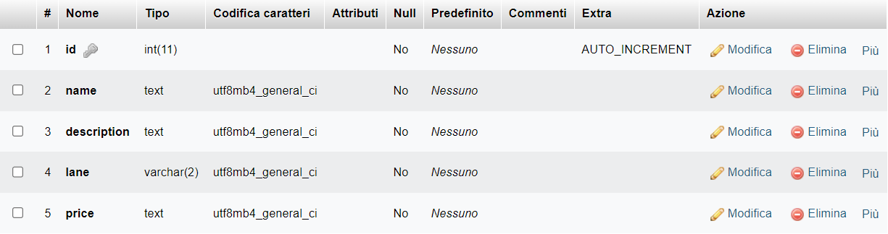
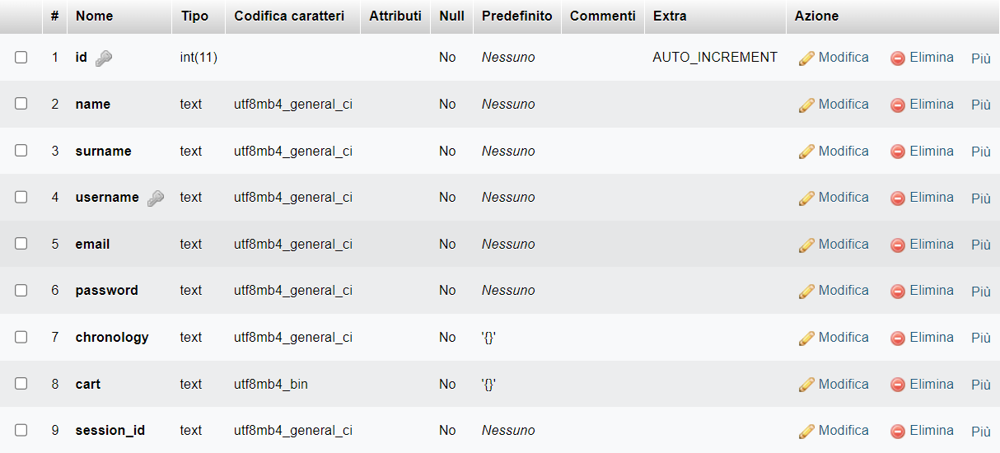

# db-connection

Questo algoritmo permette al Nao di comunicare con i database in modo da poter leggere e modificare i dati sul sito in tempo reale.

## 🛜Funzionamento
Il Nao si collega, dopo essersi autenticato con una password. Questo ci permette di conoscere da quale dispositivo viene effettuata qualsiasi operazione.

## ⚙️Funzionalità

### Lista totale degli utenti
- Input:
    ```json
    {
        "password": "",
        "request": "allUsers"
    }
    ```
- Output:
    ```json
    ["user_1", "user_2"]
    ```

### Posizione degli oggetti
La funzione ritorna la corsia dell'oggetto.
- Input:
    ```json
    {
        "password": "",
        "request": "objectPosition",
        "product": "object"
    }
    ```
- Output:
    ```json
    3 // numero della corsia
    ```

### Aggiungi al carrello
- Input:
    ```json
    {
        "password": "",
        "request": "addToCart",
        "user": "galileiisnao",
        "product": "rosa"
    }
    ```
- Output:
    ```json
    true || false
    ```

### Checkout
Questa funzione si occupa dell'ultima fase dell'acquisto. Si occuperà dello svuotamento del carrello e lo aggiungerà alla lista degli acquisti precedenti.
- Input:
    ```json
    {
        "password": "",
        "request": "checkout",
        "user": "galileiisnao",
    }
    ```
- Output:
    ```json
    {
        "total": 0.00
    }
    ```

## 📊Struttura del database
Tables:
- `products`:

    

- `users`:

    
